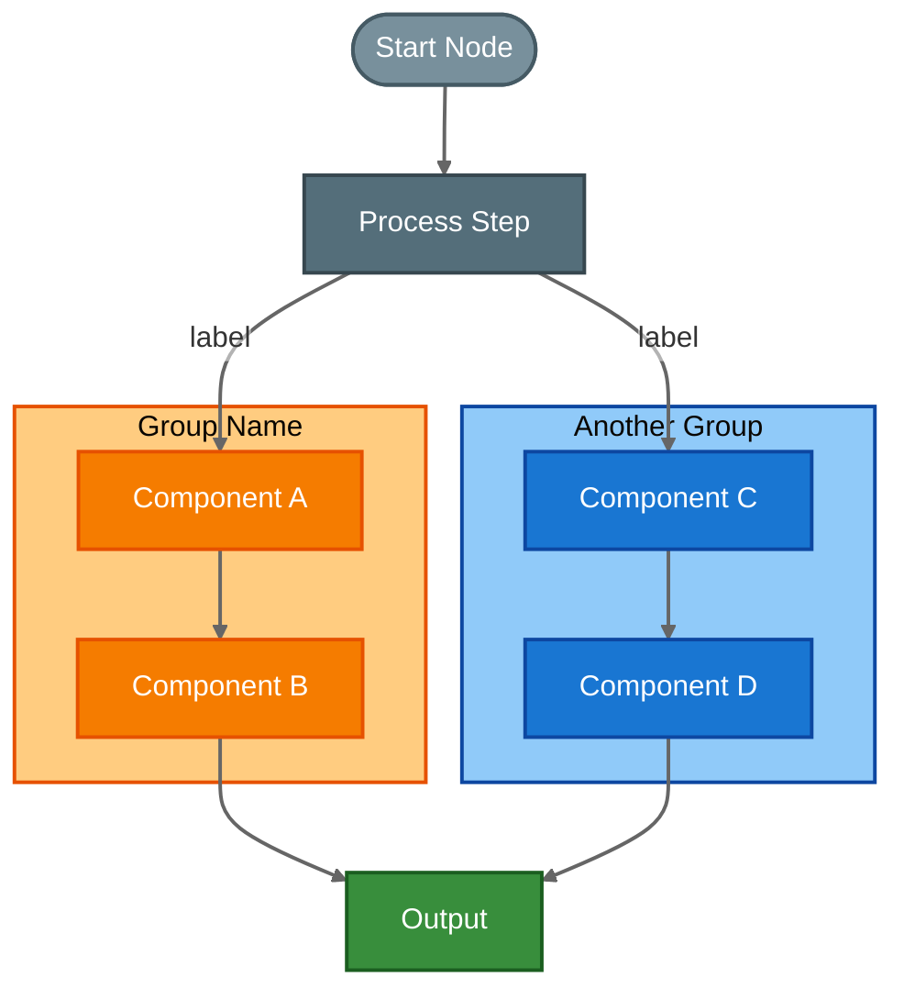

# GitHub Mermaid Diagrams

Create Mermaid diagrams that render beautifully in GitHub markdown — in **both light and dark mode**.

## Why This Skill Exists

GitHub renders Mermaid diagrams with its own renderer that behaves differently from mermaid.live or local tools:

- **Dark mode overrides text color** to light gray, making text on light-filled nodes invisible
- **Edge labels** get opaque background boxes that clash with the diagram
- **Thin edges** become nearly invisible in dark mode
- **`classDef` with `class` keyword** can create phantom nodes in some renderers
- **HTML tags** like `<br/>` work for line breaks, but `<i>`, `<b>` render as raw text in some renderers
- **The `color:` property in `style` directives** is sometimes respected, sometimes ignored depending on the theme

This skill encodes proven patterns for making diagrams work in both modes.

## Quick Start

### Step 1: Write the Mermaid diagram

Use the patterns from the [Color System](#color-system) section below. The key principle: **use medium-to-dark fill colors with explicit `color:#fff`** so text is readable regardless of GitHub's theme overrides.

### Step 2: Render locally for verification

Use the official Mermaid CLI (`@mermaid-js/mermaid-cli`) to render to PNG:

```bash
# Install if needed (npx will prompt)
npx -y @mermaid-js/mermaid-cli \
  -i diagram.mmd \
  -o diagram.png \
  -b white \
  -s 2
```

For dark mode simulation:

```bash
npx -y @mermaid-js/mermaid-cli \
  -i diagram.mmd \
  -o diagram-dark.png \
  -t dark \
  -s 2
```

### Step 3: View the rendered PNG

View the rendered PNG to check for:
- Text readability on all node fills
- Edge/arrow visibility
- Edge label readability
- Subgraph title contrast against subgraph background
- Overall layout and spacing

### Step 4: Push to GitHub and verify

Push the markdown to GitHub and check in both light and dark mode (toggle via Settings > Appearance or append `?theme=dark` / `?theme=light` to the URL).

---

## Color System

### The Core Problem

GitHub's dark mode applies a dark background (`#0d1117`) and overrides text to light colors. If your node has a light fill (e.g., `#ffe0b2`), the light text becomes invisible against it. The fix: **use fills dark enough that white text is readable, but distinct enough that they look good on a white background too**.

### Recommended Palette

These colors are tested and verified to work in both GitHub light and dark mode:

#### Node fills (use with `color:#fff`)

| Purpose        | Fill      | Stroke    | Example                                                     |
|----------------|-----------|-----------|--------------------------------------------------------------|
| **Orange/Warm** | `#f57c00` | `#e65100` | `style N fill:#f57c00,stroke:#e65100,stroke-width:2px,color:#fff` |
| **Blue/Cool**   | `#1976d2` | `#0d47a1` | `style N fill:#1976d2,stroke:#0d47a1,stroke-width:2px,color:#fff` |
| **Green**       | `#388e3c` | `#1b5e20` | `style N fill:#388e3c,stroke:#1b5e20,stroke-width:2px,color:#fff` |
| **Red/Alert**   | `#d32f2f` | `#b71c1c` | `style N fill:#d32f2f,stroke:#b71c1c,stroke-width:2px,color:#fff` |
| **Purple**      | `#7b1fa2` | `#4a148c` | `style N fill:#7b1fa2,stroke:#4a148c,stroke-width:2px,color:#fff` |
| **Neutral/Gray**| `#78909c` | `#455a64` | `style N fill:#78909c,stroke:#455a64,stroke-width:2px,color:#fff` |
| **Dark Gray**   | `#546e7a` | `#37474f` | `style N fill:#546e7a,stroke:#37474f,stroke-width:2px,color:#fff` |

#### Subgraph container fills (lighter — title text needs to be readable)

| Purpose             | Fill      | Stroke    |
|---------------------|-----------|-----------|
| **Orange container** | `#ffcc80` | `#e65100` |
| **Blue container**   | `#90caf9` | `#0d47a1` |
| **Green container**  | `#a5d6a7` | `#1b5e20` |
| **Neutral container**| `#b0bec5` | `#455a64` |

Subgraph titles inherit from the theme and can't be styled directly. Use medium-tone fills so the title is readable against both a white and dark page background.

### Theme Init Block

Always include this init block to fix edge label backgrounds and line visibility:

```
%%{init: {'theme':'base','themeVariables':{'primaryTextColor':'#333','edgeLabelBackground':'#ffffff00','lineColor':'#666'}}}%%
```

- `edgeLabelBackground: '#ffffff00'` — transparent, prevents the ugly opaque label boxes
- `lineColor: '#666'` — ensures edges are visible in both modes
- `primaryTextColor: '#333'` — sets default text dark for light mode (dark mode overrides this)

### Edge Styling

Always add this at the end of your diagram:

```
linkStyle default stroke:#666,stroke-width:2px
```

This makes edges thick enough to be visible in dark mode.

### Dashed Lines

For "phasing out" or optional paths:

```
A -. "label text" .-> B
```

---

## Patterns to Avoid

| ❌ Don't | ✅ Do Instead | Why |
|----------|--------------|-----|
| `fill:#ffe0b2` (light pastel) | `fill:#f57c00` (saturated) | Light fills + dark mode = invisible text |
| `fill:#e0e0e0` (light gray) | `fill:#78909c` (blue-gray) | Same issue — too light for dark mode |
| `fill:#fafafa` (near-white) | `fill:#546e7a` (dark gray) | Completely invisible in dark mode |
| `<i>text</i>` in labels | Just use plain text | HTML italic tags render as raw text in some renderers |
| `classDef` + `class` keyword | `style NodeId fill:...` | `class` keyword can create phantom nodes |
| Omitting `color:#fff` | Always include `color:#fff` | Even when GitHub overrides it, some renderers need it |
| Thin default edges | `linkStyle default stroke:#666,stroke-width:2px` | Default edges are nearly invisible in dark mode |
| No theme init | Always add `%%{init:...}%%` block | Prevents opaque edge label backgrounds |

---

## Complete Template

Here's a complete template showing all patterns:



---

## Verification Workflow

When creating or improving diagrams:

1. **Write** the Mermaid code using patterns above
2. **Save** to a `.mmd` file
3. **Render** with `npx -y @mermaid-js/mermaid-cli -i file.mmd -o file.png -b white -s 2`
4. **Render dark** with `npx -y @mermaid-js/mermaid-cli -i file.mmd -o file-dark.png -t dark -s 2`
5. **View** both PNGs and check all text is readable
6. **Iterate** — adjust fills if text is hard to read in either mode
7. **Push** to GitHub and spot-check both themes

For multiple diagrams, render them all in a batch:

```bash
for f in *.mmd; do
  npx -y @mermaid-js/mermaid-cli -q -i "$f" -o "${f%.mmd}.png" -b white -s 2
  npx -y @mermaid-js/mermaid-cli -q -i "$f" -o "${f%.mmd}-dark.png" -t dark -s 2
done
```

---

## Diagram Types Reference

See `references/DIAGRAM_TYPES.md` for comprehensive syntax for all supported diagram types (flowchart, sequence, state, class, ER).

## Tips

- **Keep diagrams under 20 nodes** — beyond that, consider splitting into multiple diagrams
- **Use `flowchart TD`** (top-down) for hierarchical architectures
- **Use `flowchart LR`** (left-right) for pipelines and sequential flows
- **Use `<br/>` for line breaks** in node labels — this works in GitHub's renderer
- **Use stadium shape `(["text"])`** for start/end/user nodes
- **Use cylinder shape `[("text")]`** for databases
- **Group related nodes** in subgraphs for visual clarity
- **Label all edges** — unlabeled arrows are ambiguous
