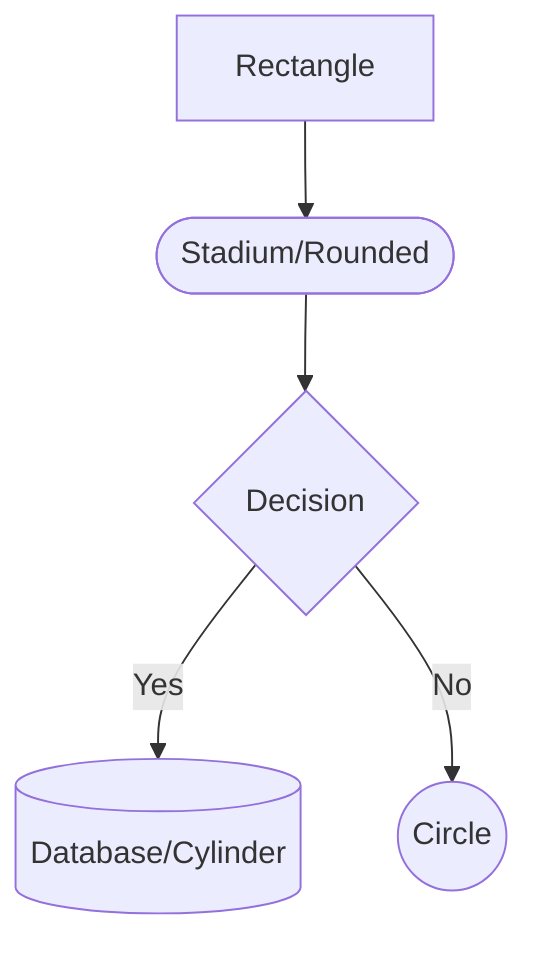
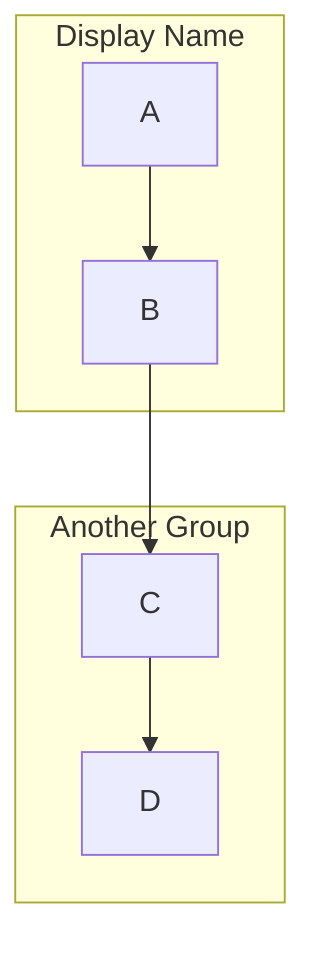
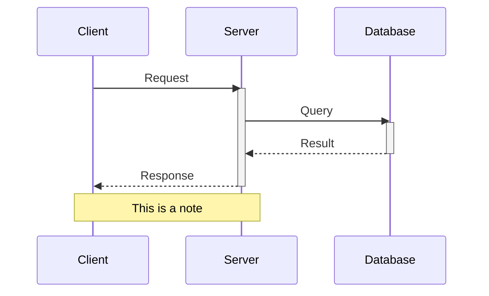
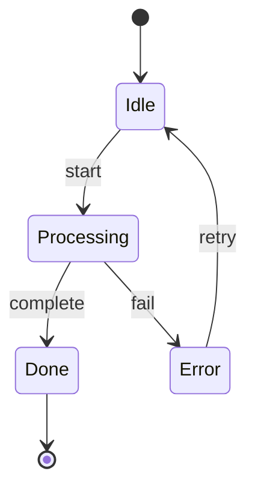
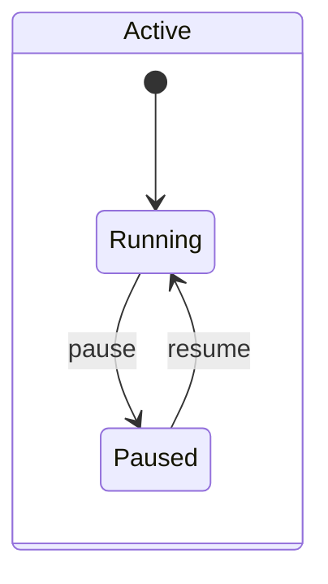
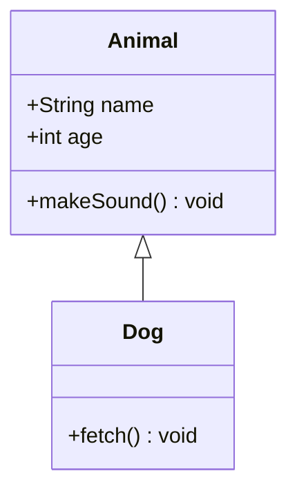
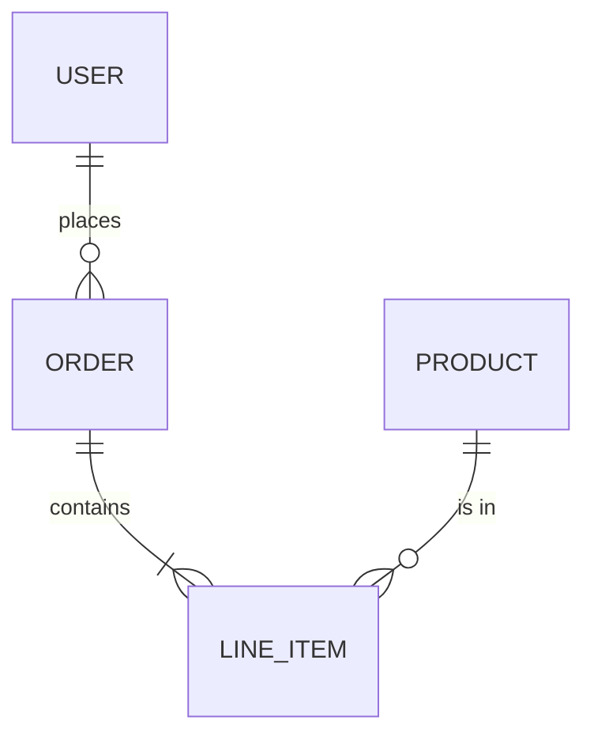

# Mermaid Diagram Types — GitHub-Compatible Syntax Reference

## Flowchart

### Node Shapes
- `["Text"]` — Rectangle (most common)
- `(["Text"])` — Stadium/rounded (start/end/users)
- `{"Text"}` — Diamond/rhombus (decisions)
- `[("Text")]` — Cylinder (databases)
- `(("Text"))` — Circle (events)
- `[["Text"]]` — Subroutine (double border)

### Edge Types
- `-->` — Solid arrow
- `---` — Solid line (no arrow)
- `-.->` — Dotted arrow
- `-. "text" .->` — Dotted arrow with label
- `==>` — Thick arrow
- `-- "text" -->` — Arrow with label
- `-->|"text"|` — Arrow with label (alt syntax)

### Direction
- `TD` / `TB` — Top to bottom (best for hierarchical)
- `LR` — Left to right (best for pipelines)
- `RL` — Right to left
- `BT` — Bottom to top

### Subgraphs

Use `direction LR` inside a subgraph to override the parent direction.

---

## Sequence Diagram

### Arrow Types
- `->>` — Solid arrow (request)
- `-->>` — Dashed arrow (response)
- `-x` — Cross (failed)
- `-)` — Async

### Grouping
- `rect rgb(200, 220, 255)` ... `end` — Highlighted region
- `loop Label` ... `end` — Loop
- `alt Label` ... `else Label` ... `end` — Conditional
- `opt Label` ... `end` — Optional

---

## State Diagram

### Composite States

---

## Class Diagram

### Relationships
- `<|--` — Inheritance
- `*--` — Composition
- `o--` — Aggregation
- `-->` — Association
- `..>` — Dependency
- `..|>` — Realization

---

## ER Diagram

### Cardinality
- `||` — Exactly one
- `o|` — Zero or one
- `}|` — One or more
- `}o` — Zero or more
